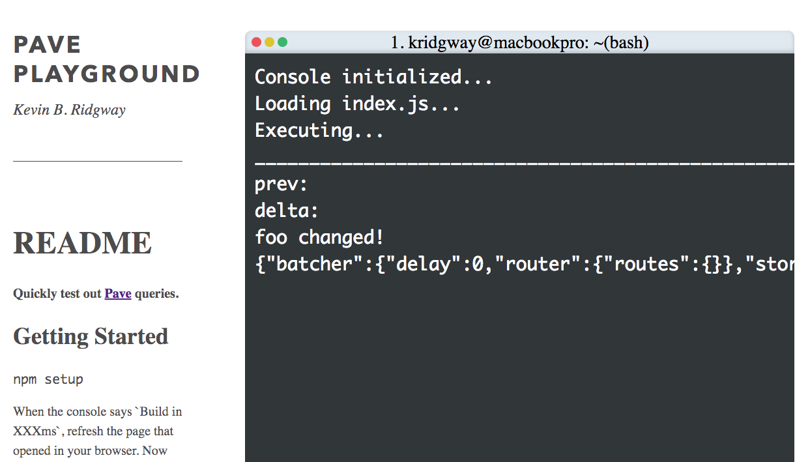

# Pave Playground

Quickly test out [Pave](https://www.npmjs.com/package/pave) queries.

## Getting Started

`npm setup`

When the console says `Build in XXXms`, refresh the page that opened in your browser. Now you have your code running with no setup! When you save index.js, the page will refresh itself automatically.

## Notes

* Uses [ParcelJS](https://parceljs.org/) to quickly get started experimenting. See the [docs](https://parceljs.org/getting_started.html).
